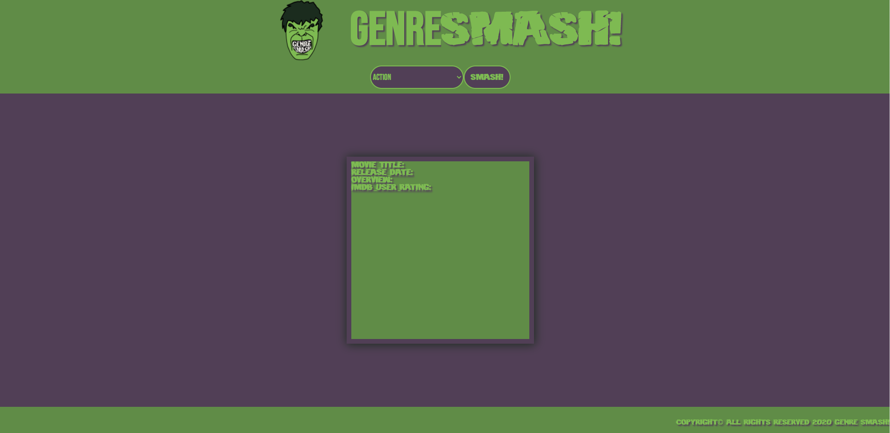
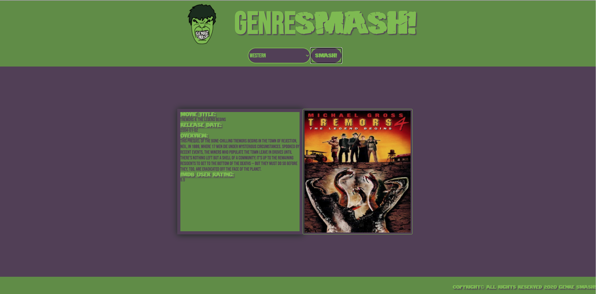
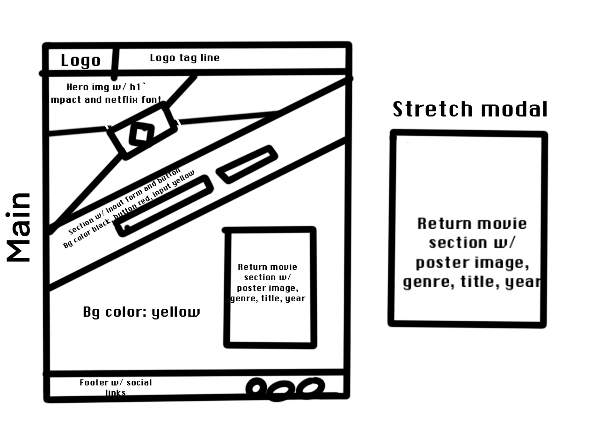
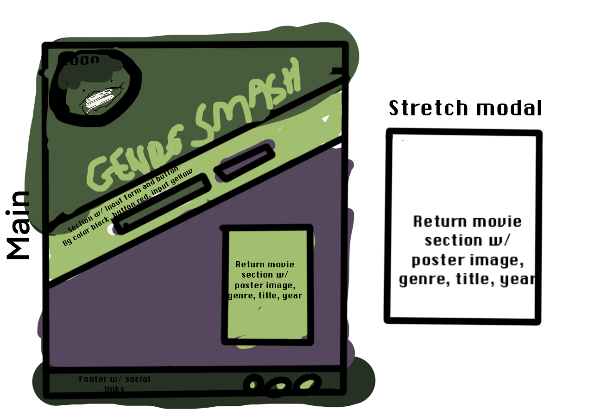

# Genre Smash!

Genre Smash is an app that returns a randomized movie based on the genre the user selects from the drop down. I was inspired to make this app as I think a randomized search by genre on my individual Netflix queue would be a nice feature to have. 

## Getting Started
 [Click Here](https://genre-smash.vercel.app/) to see the deployed app. Simply select the movie genre you want to search for and press the 'SMASH!' button. 

## Screenshots

##  Technologies/API used:

- HTML5
- CSS3
- JavaScript
- jQuery
- Procreate - wireframe and logo
- FF Fonts - Hulkbuster
- Google Fonts - Netflix font
- The Movie Database API

## Wireframe: 

## User Stories:
- As a user I should be able to enter in a genre and get back a random movie to help me figure out what movie I want to watch
- As a user I should be able to enter in another genre or try again with the same genre 

## Stretch Goals/Future Goals:
- Be able to randomize from a user's Netflix queue
- Hide API in .env

